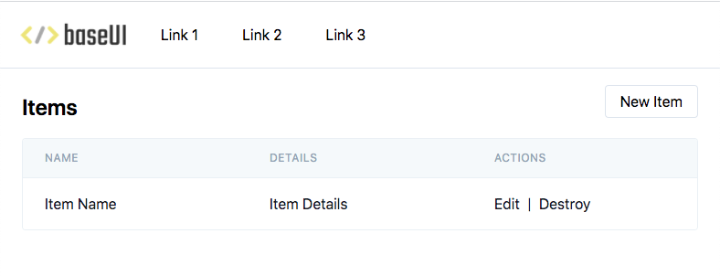

Attempts to bootstrap a minimal UI for your Rails app that plays nice with scaffolding, and is easy to customise further.

# Why?
Most templates or themes sit in two extremes:
- try to be as batteries-included as possible (e.g. authentication and background jobs), meaning if you disagree you have to undo their additions
- provide a fancy design, but require you to dig into the HTML and CSS to figure out how to apply to your app

I wanted something somewhere in the middle - not too opinionated about the rest of the app, but gives a decent design that works with Rail's generators out of the box.

# Opinions
This _is_ still opinionated:
- Rails views: no frontend framework, to keep the stack simple. It should be pretty easy to add stimulus, but I didn't want to include this as at the moment I prefer to sprinkle react-rails here and there (am open to creating variations of this repo though!)
- TailwindCSS: simplifies styling with CSS, while still providing a lot of flexibility to tweak the designs as needed
- [Webpacker](https://github.com/rails/webpacker): gives access to the Tailwind directives. I personally also remove sprockets so there's only one-way of doing things (even if it's weird to include images in JS), but that's a choice not enforced here
- No SASS: it shouldn't be too hard to add it later

# Prerequisites
- Webpacker: Rails 6 should include it out of the box, otherwise check out the [installation instructions](https://github.com/rails/webpacker#installation)

# Usage
- clone this repo
- in your Rails project (best to commit first), run `rails app:template LOCATION=/path/to/rails-templates/base_ui/template.rb`
- do a scaffold `rails g scaffold ...`
- check out the scaffolded UI!
